# Student Hub


### What is Student Hub?
It is a platform where new university studnet can get information from mentors about university including enrolment, accommodation, society, volunteer opportunity and career planning, whihch enable them have a better preparation for their upcoming uni life. They are able to choose the topic they are interested in and talk to experienced mentors who is specialized at this area.

### Why we need Student Hub?
During Oweek in university, the stall provided information about uni is always very busy which cause each student only have very few time to consult. 
Also, since many student and mentor live far away from uni which make them unable to attend Oweek or only attend for limited time.  
In addition, many students complain that oweek is too late to get information. They want to obtain these information before oweek.


**Student Hub** can solve all of these problems. It provide remote match/chat platform for students and mentors which enable them to talk at **anytime and anywhere**.

---

### Tech Stack
##### **Backend**
- Spring Boot
- Maven
- Spring Cloud
- Netty

##### **Frontend**
- React
- Webpack
- Storybook(UI management)
- Material UI

---

### About Project 
##### **Backend**
This is a **spring-cloud** project, and consists of 3 Microservices and Eureka.

Start **Eureka** first, which works as a register-center.
Then start **StduentChat, MentorChat, MatchCenter** in any order. But you may need to wait for a few minutes enable the microservices connect and communicate with each other.

- Eureka: Used for register all microservices.
- StduentChat: This microservice provide chat service on student side. It use **netty** to connect with the frontend by webSocket. Also, it applies feignClient to consume other service.
- MentorChat: It is similiar with studentChat but provides the service on mentor side
- MatchCenter: It deals with most of the logic in this project. This microservice matches student with correct mentor(who choose same topic), transfer message to mentor matched and inform student/mentor when the other person already leave. Also, it connect with frontend to tell how many mentor available at this moment by websocket.
##### **Frontend**
Frontend is a **React** project. It use **webpack** to bundle JavaScript files and use **storybook** to do UI management.
Also, the project support hot reload.

##### Frontend Scripts

```
cd <project-name>
cd frondend
npm install
npm start
```
Install all dependencies and start frontend application

```
npm run storybook
```
Show all UI components with storybook

---
### Demo

Index & Choose Profile<br />
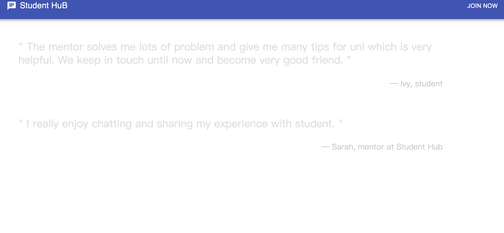
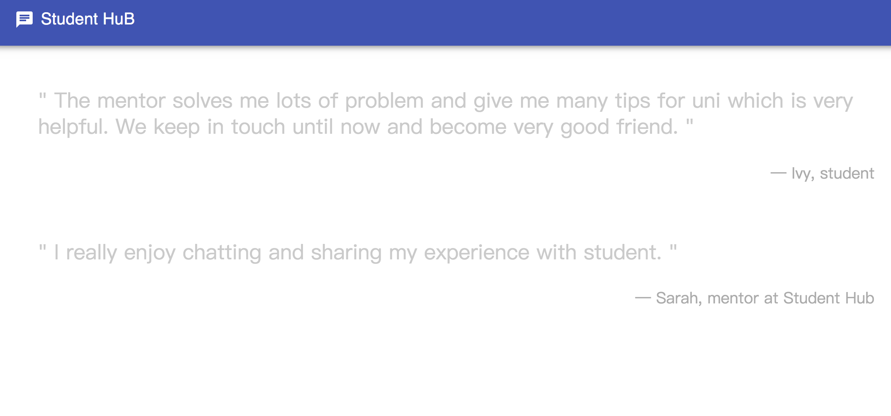
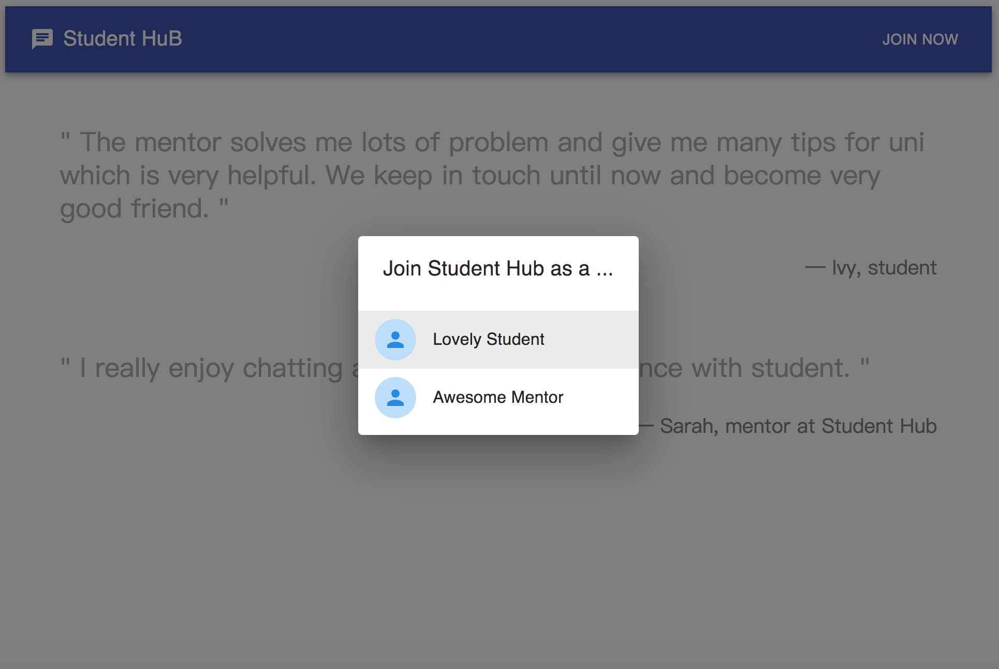

Choose Topic(Student Page)<br />
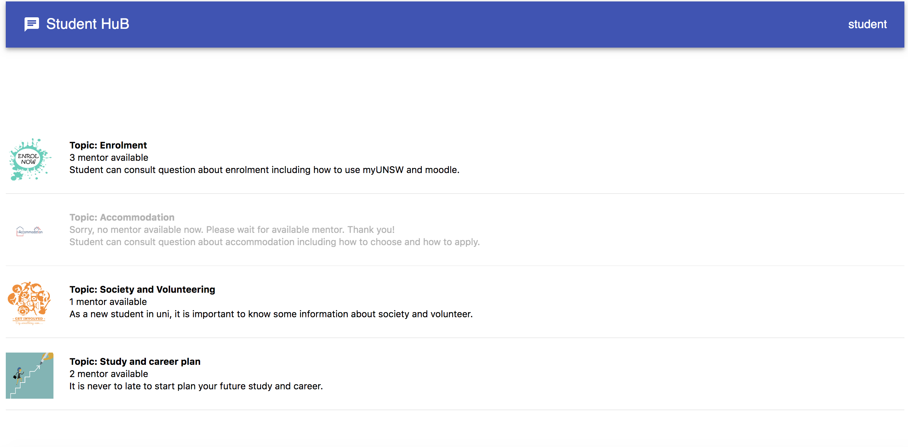
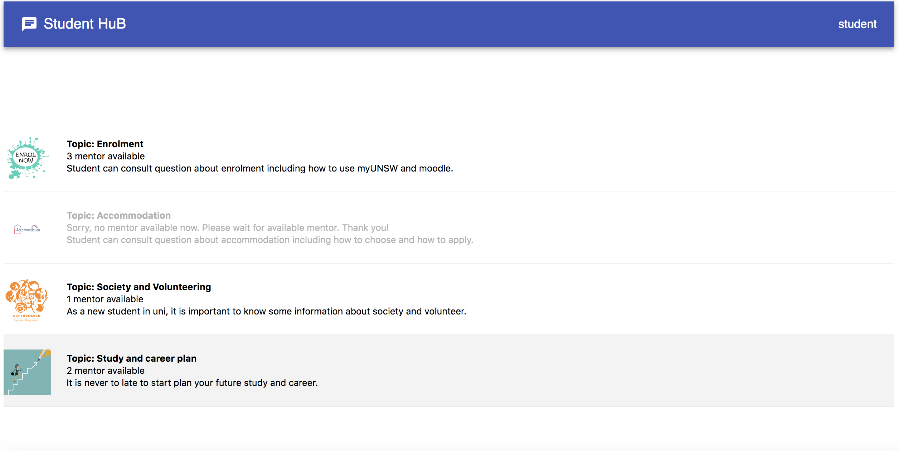
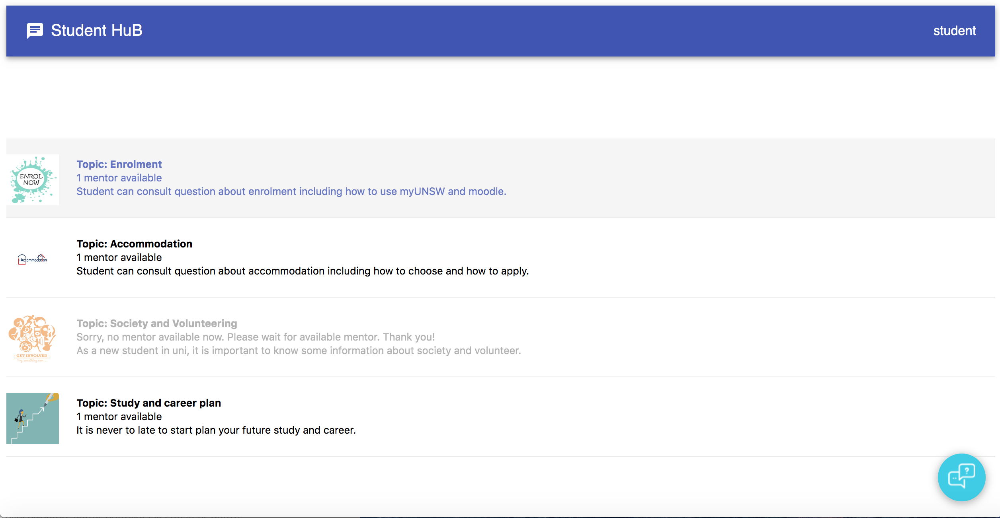

Choose Topic(Mentor Page)<br />
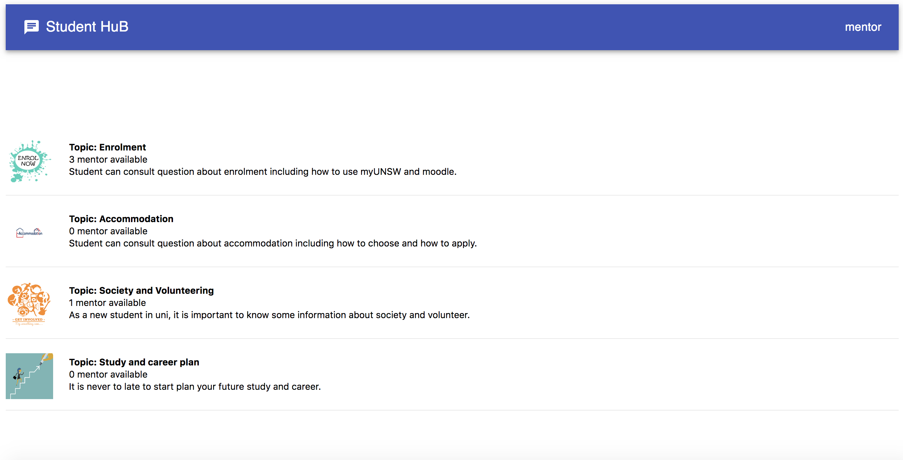
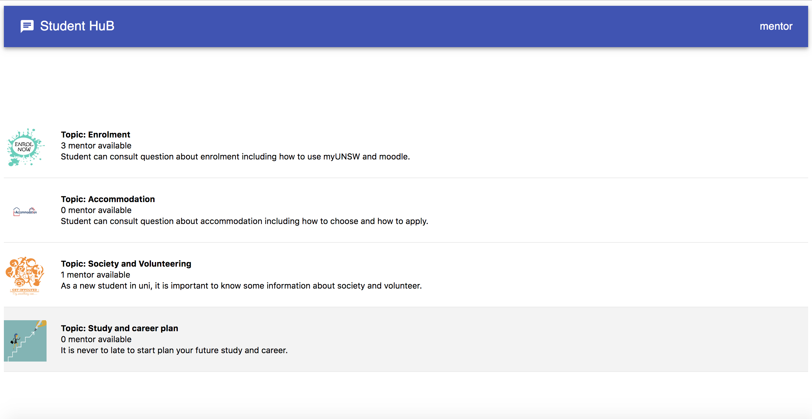
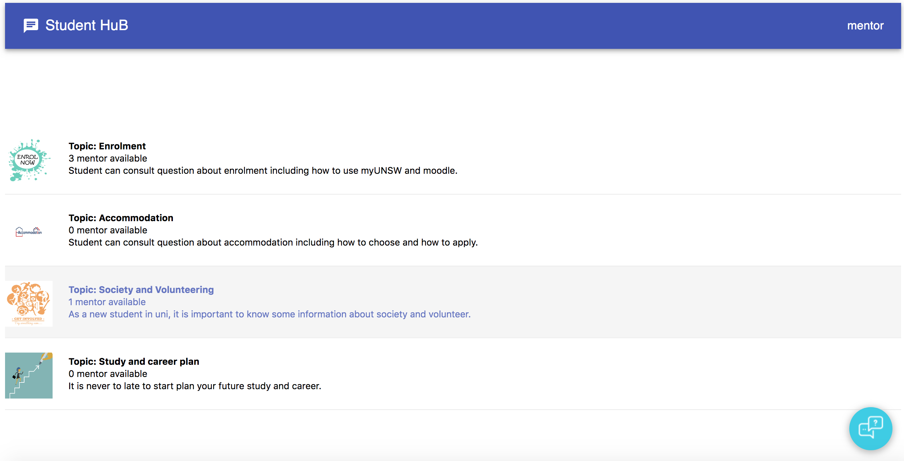

Chat<br />
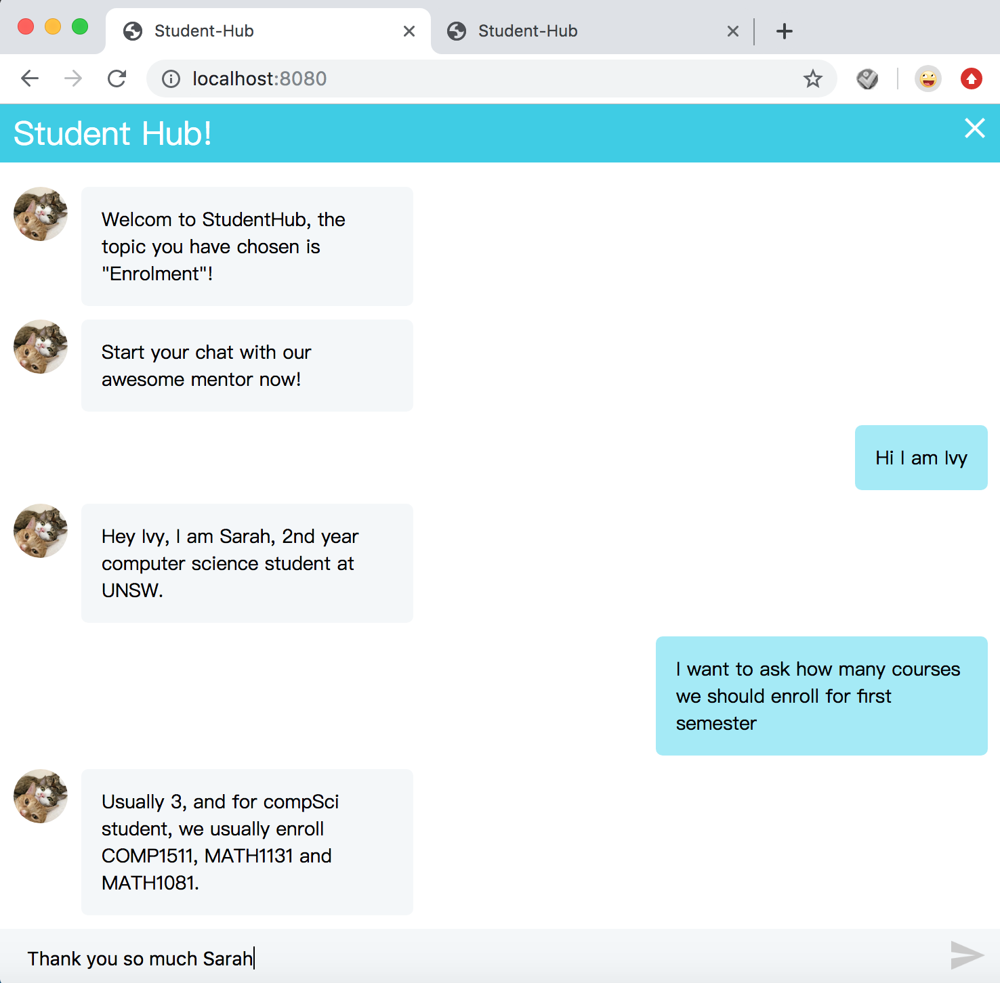
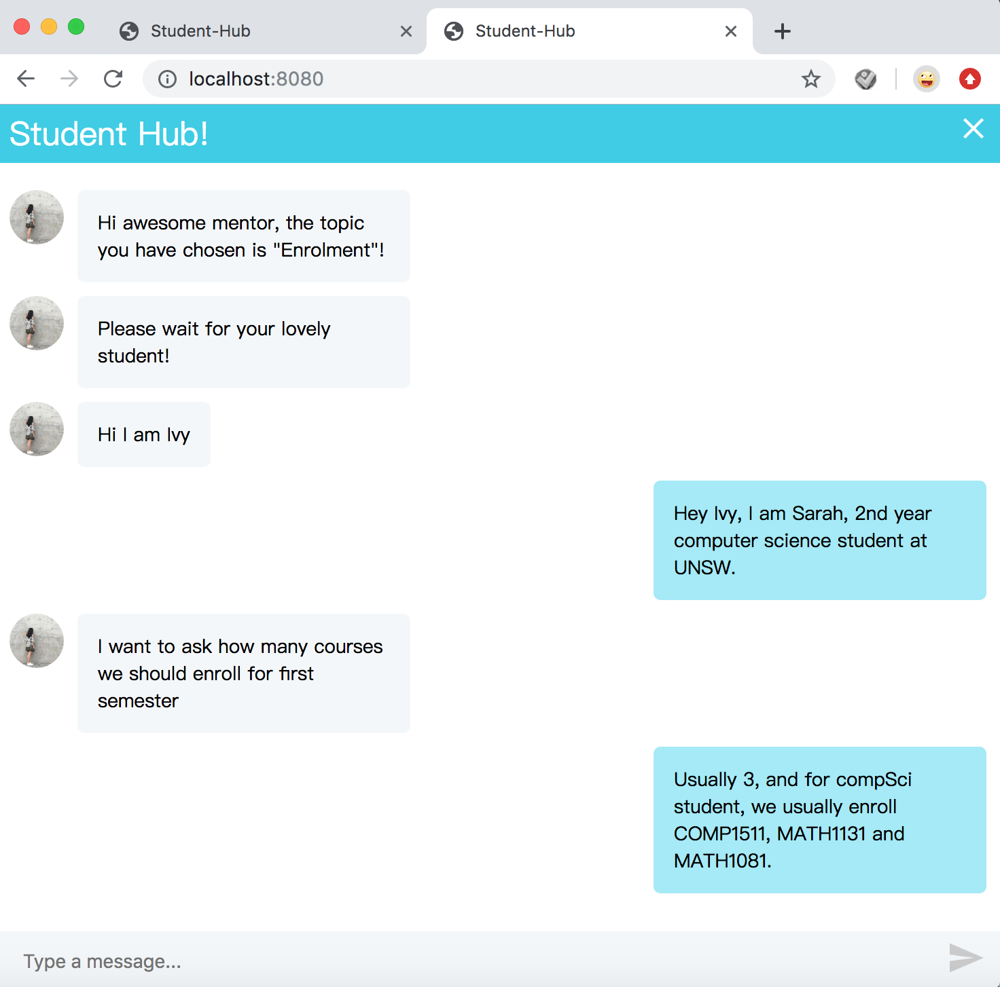
